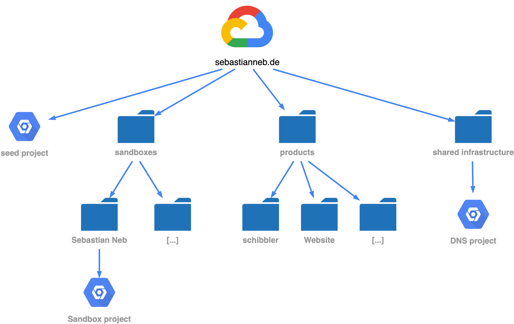
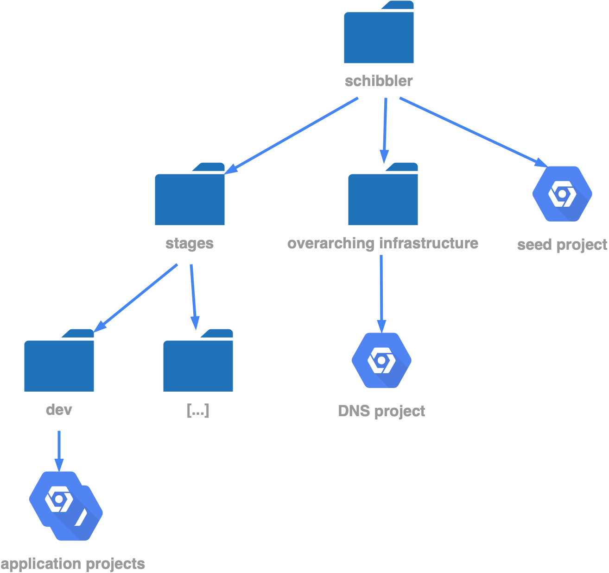

# Schostins GCP organization setup

[](https://github.com/schostin/gcp-organization/actions/workflows/reviewdog.yml)
[](https://github.com/schostin/gcp-organization/actions/workflows/terraform.yml)

This repository contains the source code to actively manage the google organization of sebastianneb.de.

## Design Overview

### Organization Overview



The organization consists of 3 main folders and 1 initially project that has to be setup manually.
The seed project contains the initial service account needed to create the folders and projects
and also the needed bucket for the terraform state file.
The 3 main folders hold the following purposes:

- **sandboxes**: The purpose of this folder is tryouts of people using Google Cloud for the first time.
  Subsequent folder can be managed by giving it the name of the team or people who want to tryout things.
  IAM rights for `projectCreator` can then be granted on the folder level to individual members or teams
  so that the the members can tryout everything they want to test.
- **products**: The purpose of this folder is to actually contain products which will be managed via
  infrastructure as code and whill potentially also hold products with production data. The structure
  within this folder for each individual product is outlined below.
- **shared infrastructure**: The purpose of this folder is to contain organization overarching components
  like the DNS managed zone for the organization. Potentially also something like a self-hosted Gitlab
  or shared VPC hosts for interconnects. Everything that needs to be shared across products or sandboxes
  it possible here.

### Product Overview



An individual product consists of 2 folders and 1 project. Every other component the application needs
(like individual folders for the different stages or the needed projects and deployments) should
be placed in the folder `stages`. The folder `overarching-infrastructure` contains created projects
like `DNS zone` which already holds e.g. a managed DNS zone and is linked to the shared DNS zone if needed.
With this setup the product is able to link itself within the organization but be self-contained in what
the product actually needs. Further other overarching infrastructure might be added as well (like a
pre-configured shrared VPC host project or something similar).
The `seed-project` holds everything that the organization creates in order for the product to be able
to create the needed folder structure / projects / service account / etc. within `stages` on their own.
This includes:

- State bucket for the initial terraform pipeline
- Service account that gets permissions:
  - Project Creator / Deleter / Manager within the `stages` folder.
  - Service account creator / deleter within the seed-project to create more needed service accounts.
  - Permissions to access the state bucket for the initial terraform pipeline to create e.g. the different
    stages.
- ...

## Implementation details

### Seeding

For the very initial run and in order to create this organization setup, we do need a seed account with a
storage bucket and service account in order to save the terraform state and run / apply the terraform changes.

In order to do so follow the following steps.

- Get the organization id and think of a name and id for the seed project (`gcloud organizations list`).
- Create a new project with the command
  `gcloud projects create "$SEED_PROJECT_ID" --name "$SEED_PROJECT_NAME" --organization "$ORGANIZATION_ID"`
- Get the project ID of the created project with `gcloud projects list`. Set this project as default for
  all following commands by `gcloud config set project $SEED_PROJECT_ID`.
- Create a new billing account (or use an existing one) and Link the billing account to the project with
  `gcloud beta billing projects link "$SEED_PROJECT_ID" --billing-account "$BILLING_ACCOUNT_ID"`
- We need to enable some APIs first, the rest can later be activated via Code. This can be done with
  `gcloud services enable cloudresourcemanager.googleapis.com` and repeat for:
  - iamcredentials.googleapis.com
  - cloudbilling.googleapis.com
  - iam.googleapis.com
- Create a new service account within the new seed project to be used by the terraform pipeline. This can be
  done with the command
  `gcloud iam service-accounts create "$SERVICE_ACCOUNT_NAME" --display-name="Service Account for Organization Terraform Usage"`.

  You can get the mail of the created service account with `gcloud iam service-accounts list`.

- Next we need to grant the necessary roles to the service account on the organization level. This can be done with the command:

  ```bash
  gcloud organizations add-iam-policy-binding "$ORGANIZATION_ID" \
  --member "serviceAccount:$SERVICE_ACCOUNT_EMAIL" \
  --role "roles/resourcemanager.folderAdmin"
  ```

  You'll have to repeat this command for the following roles:

  - roles/resourcemanager.folderAdmin
  - roles/resourcemanager.projectCreator
  - roles/resourcemanager.projectDeleter

- You also have to grant the created service account rights on the billing account. This can be done with:

  ```bash
  gcloud beta billing accounts add-iam-policy-binding 012A37-911A41-9E7FAA \
  --member "serviceAccount:$SERVICE_ACCOUNT_EMAIL" \
  --role "roles/billing.user"
  ```

- After that we have to create a GCS state bucket that will holde the initial terraform state files. The command
  can be used: `gsutil mb -b on -l EUROPE-WEST3 gs://$BUCKET_NAME`
- Grant the service account access rights on the created bucket (best via the UI)
- If we want to use GitHub Actions Workload Identity Federation we also have to create the necessary resources for this. For more
  information visit [](https://cloud.google.com/blog/products/identity-security/enabling-keyless-authentication-from-github-actions)

  - Create the Workload Identity Pool with
    `gcloud iam workload-identity-pools create "github-auth" --location="global" --display-name="GitHub Auth Pool"`
  - Create the attribute mapping with

    ```bash
    gcloud iam workload-identity-pools providers create-oidc "github-provider" \
    --location="global" \
    --workload-identity-pool="github-auth" \
    --display-name="GitHub provider" \
    --attribute-mapping="google.subject=assertion.sub,attribute.actor=assertion.actor,attribute.repository=assertion.repository" \
    --issuer-uri="https://token.actions.githubusercontent.com"
    ```

  - Grant the service account the right to be impersonated from GH actions with

    ```bash
    gcloud iam service-accounts add-iam-policy-binding "$SERVICE_ACCOUNT_EMAIL" \
    --role="roles/iam.workloadIdentityUser" \
    --member="principalSet://iam.googleapis.com/projects/$PROJECT_NUMBER/locations/global/workloadIdentityPools/github-auth/subject/$GITHUB_REPOSITORY_WITH_OWNER"
    ```

- For local development we can grant our own user the right to impersonate the service account or download the credentials and use those with
  the environment variable `GOOGLE_CREDENTIALS` which.

### Base Infrastructure

I am using terragrunt to further orchestrate the different steps and make use of easier and speakable
environment variables instead of prefixing those with `TF_VAR_`.
